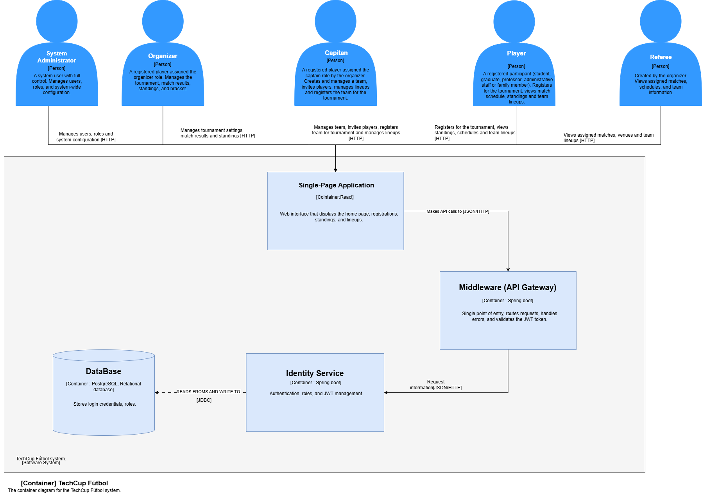
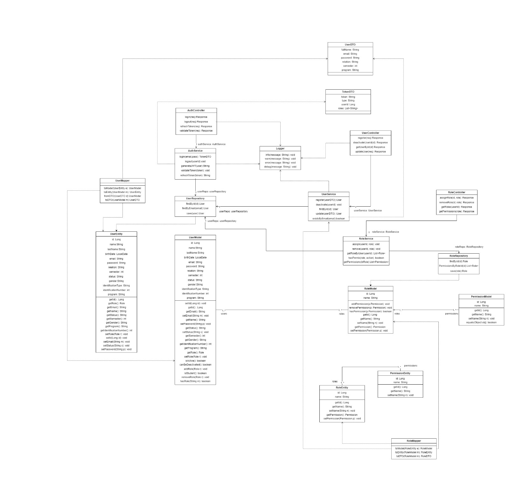
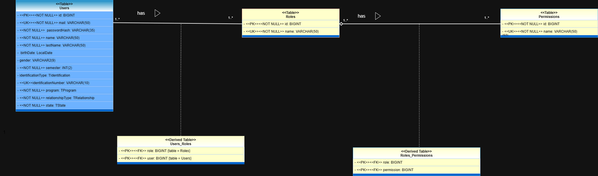

# TECHCUP FÚTBOL

> [!IMPORTANT]
> Este repositorio contiene el *BackEnd* para el servicio de **Identidad**

> Para información general del proyecto consulta el [README general de la organización](https://github.com/techcup-futbol-dosw).

---

## Tabla de contenido

- [Integrantes](#integrantes)
- [Descripción general](#descripción-general)
- [Requerimientos](#requerimientos)
- [Stack tecnológico](#stack-tecnológico)
- [Estructura del proyecto](#estructura-del-proyecto)
- [Configuración local](#configuración-local)
- [Modelación y diagramas](#modelación-y-diagramas)
- [Funcionalidades del servicio](#funcionalidades-del-servicio)
- [API y Endpoints](#api-y-endpoints)
- [Pruebas y calidad](#pruebas-y-calidad)
- [CI/CD](#cicd)

---

## Integrantes

* **Product Owner:** [EDUARDO RICO DUARTE](https://github.com/EduardoRico26) → [eduardo.rico@mail.escuelaing.edu.co](mailto:eduardo.rico@mail.escuelaing.edu.co)
* **Líder técnico:** [LUIZA MARIANA GONZALEZ VELOZA](https://github.com/LuizaGonzalez) → [luiza.gonzalez-v@mail.escuelaing.edu.co](mailto:luiza.gonzalez-v@mail.escuelaing.edu.co)
* **Analista funcional:** [JUAN DAVID MORENO D'ALEMAN](https://github.com/JDavid-Moreno) → [juan.mdaleman@mail.escuelaing.edu.co](mailto:juan.mdaleman@mail.escuelaing.edu.co)
* **Desarrollador:** [JUAN DAVID ROA HERNÁNDEZ](https://github.com/JuanDeRe) → [juan.roa-h@mail.escuelaing.edu.co](mailto:juan.roa-h@mail.escuelaing.edu.co)
* **Desarrollador:** [KAROL XIMENA RODRIGUEZ REYES](https://github.com/Karol-Reyes ) → [karol.rodriguez-r@mail.escuelaing.edu.co](mailto:karol.rodriguez-r@mail.escuelaing.edu.co)

---

## Descripción general

> [!NOTE]
> Este servicio es el responsable de la gestión de autenticación, autorización y control de acceso al sistema. Es el punto central de seguridad y permite garantizar que solo usuarios autorizados accedan a los recursos.


### Funcionalidades del servicio

| Funcionalidad | Descripción | Roles permitidos |
|---------------|-------------|-----------------|
| Registro de usuarios | El sistema permitirá el registro de usuarios con los siguientes tipos de correo:<br>● Institucional: estudiante, profesor, administrativo o graduado.<br>● Personal: familiar.<br><br>Durante el registro se deberá capturar:<br>● Nombre completo.<br>● Correo electrónico.<br>● Contraseña.<br>● Relación con la Escuela: estudiante, profesor, administrativo, graduado o familiar.<br>● Programa académico con el cual tiene relación.<br>● Semestre (si es estudiante).<br>● Estado: Activo o Inactivo. Por defecto, se crea activo.<br><br>El administrador se registrará directamente a nivel de base de datos con todos los permisos habilitados.<br>Todos los usuarios al momento de ser registrados quedan con rol jugador, excepto el árbitro. A los árbitros los creará el organizador del torneo. | Público |
| Inactivar usuario | Un usuario se puede inactivar siempre y cuando no esté vinculado a un equipo que esté inscrito a un torneo activo o en progreso. | Administrador |
| Autenticación (Login) | El sistema permitirá a los usuarios autenticarse mediante el correo electrónico y contraseña. Como resultado, se generará un token JWT para permitir el acceso a los demás servicios. La contraseña debe estar cifrada. | Público |
| Autorización (Roles y Permisos) | El sistema manejará los siguientes roles: jugador, capitán, organizador, árbitro y administrador. Cada rol tendrá permisos específicos sobre los diferentes servicios (en cada servicio se detalla qué acción puede hacer cada rol). El administrador del sistema podrá asignar, remover y consultar el rol de un usuario. | Administrador |
| Gestión de sesión | ● Generación de JWT al autenticarse.<br>● Validación de token en cada solicitud.<br>● Expiración de la sesión. | Todos los usuarios autenticados |
| Control de acceso | El servicio debe validar:<br>● Que el usuario esté autenticado.<br>● Que tenga permisos para ejecutar la acción solicitada. | Todos los usuarios autenticados |
| Auditoría | Se registrarán las siguientes acciones:<br>● Inicio de sesión.<br>● Registro de usuario.<br>● Cierre de sesión. | Administrador |

---

### Requerimientos

> Los requerimientos funcionales y no funcionales de este servicio se encuentran documentados en [`docs/requirements/requirements.md`](docs/requirements/requirements.md)

---

## Stack tecnológico

### Backend


### Base de datos


-4479A1?style=for-the-badge)

### Testing y calidad


### Herramientas y DevOps


---

## Estructura del proyecto

```
📦 techcup-identity/
├── 📂 .github/
│   └── 📂 workflows/
│       └── 📄 IdentityService.yml              # Pipeline CI/CD: build, test y deploy a Azure
├── 📂 .mvn/
│   ├── 📄 jvm.config                           # Flags de JVM para el build de Maven
│   └── 📄 maven.config                         # Argumentos globales de Maven (ej. --batch-mode)
├── 📂 docs/
│   ├── 📂 images/
│   │   ├── 🖼️ Squad4-Contenedores.png          # Diagrama C4 de contenedores del sistema
│   │   ├── 🖼️ Squad4-Clases.jpeg               # Diagrama de clases del dominio
│   │   ├── 🖼️ Techcup-DiagramaEntidadRelacion.png # Diagrama ER de la base de datos
│   │   ├── 🖼️ CU1.png … CU13.png              # Casos de uso (13 diagramas)
│   │   ├── 🖼️ E1H1.png … E1H5.png             # Épica 1: historias de usuario (5 capturas)
│   │   ├── 🖼️ E2H1.png … E2H3.png             # Épica 2: historias de usuario (3 capturas)
│   │   └── 🖼️ E3H1.png … E3H5.png             # Épica 3: historias de usuario (5 capturas)
│   ├── 📂 planning/
│   │   └── 📄 Borrador.txt                     # Notas y borradores de planificación
│   └── 📂 requirements/
│       └── 📄 requirements.md                  # Requerimientos funcionales y no funcionales
├── 📂 src/
│   ├── 📂 main/
│   │   ├── 📂 java/edu/eci/dosw/
│   │   │   ├── 📄 TechCupIdentityApplication.java   # Punto de entrada Spring Boot
│   │   │   │
│   │   │   ├── 📂 client/                      # Clientes Feign para comunicación entre microservicios
│   │   │   │   ├── 📄 TeamClient.java           # Consulta si una cuenta está vinculada a un equipo
│   │   │   │   ├── 📄 TournamentClient.java     # Consulta si un equipo está en torneo activo
│   │   │   │   └── 📄 UserClient.java           # Integración con el servicio de usuarios
│   │   │   │
│   │   │   ├── 📂 config/                       # Inicializadores de datos al arrancar la aplicación
│   │   │   │   ├── 📄 AdminDataInitializer.java         # Crea la cuenta administrador si no existe
│   │   │   │   ├── 📄 PermissionDataInitializer.java    # Siembra los permisos del sistema en BD
│   │   │   │   └── 📄 RoleDataInitializer.java          # Siembra los roles (jugador, árbitro, etc.)
│   │   │   │
│   │   │   ├── 📂 controller/                   # Controladores REST (capa de entrada HTTP)
│   │   │   │   ├── 📄 AuthController.java        # /auth: login, logout, refresh, validate
│   │   │   │   ├── 📄 AccountController.java     # /accounts: registro, consulta, inactivación
│   │   │   │   └── 📄 RoleController.java        # /roles: listar, asignar y remover roles
│   │   │   │
│   │   │   ├── 📂 dto/                          # Objetos de transferencia de datos (Request / Response)
│   │   │   │   ├── 📄 AuthRequest.java                  # Credenciales de login (email + password)
│   │   │   │   ├── 📄 AuthResponse.java                 # Tokens JWT devueltos al autenticarse
│   │   │   │   ├── 📄 LogoutRequest.java                # Refresh token a revocar en logout
│   │   │   │   ├── 📄 RefreshTokenRequest.java          # Token de refresco para renovar sesión
│   │   │   │   ├── 📄 TokenValidationRequest.java       # JWT a validar por otros servicios
│   │   │   │   ├── 📄 TokenValidationResponse.java      # Resultado de la validación del JWT
│   │   │   │   ├── 📄 RegisterAccountRequest.java       # Datos del formulario de registro
│   │   │   │   ├── 📄 AccountResponse.java              # Perfil completo de una cuenta
│   │   │   │   ├── 📄 AccountAdminItemResponse.java     # Ítem resumido para listados de admin
│   │   │   │   ├── 📄 AccountAdminPageResponse.java     # Página paginada de cuentas (admin)
│   │   │   │   ├── 📄 AccountAdminSearchCriteria.java   # Filtros de búsqueda de cuentas
│   │   │   │   ├── 📄 AssignRoleRequest.java            # Datos para asignar un rol a una cuenta
│   │   │   │   ├── 📄 RemoveRoleRequest.java            # Datos para remover un rol de una cuenta
│   │   │   │   └── 📄 RoleSummaryResponse.java          # Resumen de un rol (id + nombre)
│   │   │   │
│   │   │   ├── 📂 entity/                       # Entidades JPA (proyección de dominio a BD)
│   │   │   │   ├── 📄 AccountEntity.java         # Tabla accounts + relación N:M con roles
│   │   │   │   ├── 📄 RoleEntity.java            # Tabla roles + relación N:M con permisos
│   │   │   │   ├── 📄 PermissionEntity.java      # Tabla permissions
│   │   │   │   └── 📄 RefreshTokenEntity.java    # Tabla refresh_tokens (con flag revocado)
│   │   │   │
│   │   │   ├── 📂 exception/                    # Manejo centralizado de errores
│   │   │   │   ├── 📄 GlobalExceptionHandler.java           # @ControllerAdvice: mapea excepciones a HTTP
│   │   │   │   ├── 📄 ApiErrorResponse.java                 # Cuerpo estándar de respuesta de error
│   │   │   │   ├── 📄 BusinessException.java                # Excepción base del dominio
│   │   │   │   ├── 📄 AccountNotFoundException.java         # 404: cuenta no encontrada
│   │   │   │   ├── 📄 AccountNotActiveException.java        # 403: cuenta inactiva
│   │   │   │   ├── 📄 AccountAlreadyInactiveException.java  # 409: ya estaba inactiva
│   │   │   │   ├── 📄 AccountCannotBeDeactivatedException.java # 409: cuenta en torneo activo
│   │   │   │   ├── 📄 EmailAlreadyRegisteredException.java  # 409: email duplicado
│   │   │   │   ├── 📄 IdentificationAlreadyRegisteredException.java # 409: documento duplicado
│   │   │   │   ├── 📄 InvalidCredentialsException.java      # 401: email/password incorrectos
│   │   │   │   ├── 📄 InvalidRefreshTokenException.java     # 401: refresh token inválido
│   │   │   │   ├── 📄 InvalidRegistrationDataException.java # 400: datos de registro inválidos
│   │   │   │   ├── 📄 InvalidAccountBuildException.java     # 400: error al construir la cuenta
│   │   │   │   ├── 📄 InvalidEmailForRelationException.java # 400: correo no corresponde a la relación
│   │   │   │   ├── 📄 MissingRequiredFieldException.java    # 400: campo obligatorio ausente
│   │   │   │   ├── 📄 RefreshTokenNotFoundException.java    # 404: refresh token no encontrado
│   │   │   │   ├── 📄 RefreshTokenRevokedException.java     # 401: refresh token ya revocado
│   │   │   │   ├── 📄 RoleNotFoundException.java            # 404: rol no encontrado
│   │   │   │   └── 📄 ExternalServiceException.java         # 502: fallo al llamar microservicio externo
│   │   │   │
│   │   │   ├── 📂 mapper/                       # Conversores entre capa de dominio y JPA/DTO (MapStruct)
│   │   │   │   ├── 📄 AccountMapper.java         # Account ↔ AccountEntity ↔ AccountResponse
│   │   │   │   ├── 📄 RoleMapper.java            # Role ↔ RoleEntity ↔ RoleSummaryResponse
│   │   │   │   └── 📄 PermissionMapper.java      # Permission ↔ PermissionEntity
│   │   │   │
│   │   │   ├── 📂 model/                        # Modelos de dominio y enumeraciones
│   │   │   │   ├── 📄 Account.java              # Modelo de dominio principal de una cuenta
│   │   │   │   ├── 📄 AccountBuilder.java       # Builder con validaciones de negocio para Account
│   │   │   │   ├── 📄 Role.java                 # Modelo de dominio de un rol
│   │   │   │   ├── 📄 Permission.java           # Modelo de dominio de un permiso
│   │   │   │   ├── 📄 AccountStatus.java        # Enum: ACTIVE / INACTIVE
│   │   │   │   ├── 📄 Gender.java               # Enum: MALE / FEMALE / OTHER
│   │   │   │   ├── 📄 IdentificationType.java   # Enum: CC / TI / CE / PASSPORT
│   │   │   │   ├── 📄 Program.java              # Enum: programas académicos de la ECI
│   │   │   │   └── 📄 Relation.java             # Enum: STUDENT / PROFESSOR / ADMIN / GRADUATE / FAMILY
│   │   │   │
│   │   │   ├── 📂 repository/                   # Interfaces Spring Data JPA
│   │   │   │   ├── 📄 AccountRepository.java       # Consultas por email, identificación y filtros paginados
│   │   │   │   ├── 📄 RoleRepository.java          # Búsqueda de roles por nombre
│   │   │   │   ├── 📄 PermissionRepository.java    # Búsqueda de permisos por nombre
│   │   │   │   └── 📄 RefreshTokenRepository.java  # Gestión de refresh tokens (buscar / revocar)
│   │   │   │
│   │   │   ├── 📂 security/                     # Configuración de seguridad Spring Security
│   │   │   │   ├── 📄 SecurityConfig.java                  # Cadena de filtros, CORS, rutas públicas
│   │   │   │   ├── 📄 JwtAuthenticationFilter.java         # Extrae y valida el JWT en cada request
│   │   │   │   ├── 📄 AccountAccessPolicy.java             # Reglas de acceso por permiso o propietario
│   │   │   │   ├── 📄 AccessDeniedHandlerImpl.java         # Responde 403 en JSON al denegar acceso
│   │   │   │   └── 📄 AuthenticationEntryPointImpl.java    # Responde 401 en JSON si no hay token
│   │   │   │
│   │   │   └── 📂 service/                      # Lógica de negocio (capa de aplicación)
│   │   │       ├── 📄 AuthService.java           # Login, logout, refresh y validación de tokens
│   │   │       ├── 📄 AccountService.java        # Registro, consulta, búsqueda e inactivación de cuentas
│   │   │       ├── 📄 JwtService.java            # Generación, parsing y validación de JWT
│   │   │       └── 📄 RoleService.java           # Asignación, remoción y consulta de roles
│   │   │
│   │   └── 📂 resources/
│   │       ├── 📄 application.properties          # Configuración base (sin credenciales)
│   │       ├── 📄 application-local.properties    # Perfil local (gitignored en producción)
│   │       └── 📄 application-azure.properties    # Perfil de Azure (lee variables de entorno)
│   │
│   └── 📂 test/
│       ├── 📂 java/edu/eci/dosw/
│       │   ├── 📄 TechCupIdentityApplicationTest.java      # Smoke test: contexto Spring arranca
│       │   │
│       │   ├── 📂 integration/                    # Pruebas de integración con H2 en memoria
│       │   │   ├── 📄 AuthControllerIntegrationTest.java       # Flujos completos de auth (login/logout/refresh)
│       │   │   ├── 📄 AccountControllerIntegrationTest.java    # Flujos de registro, consulta e inactivación
│       │   │   ├── 📄 RoleControllerIntegrationTest.java       # Flujos de asignación y remoción de roles
│       │   │   └── 📄 NewIntegrationTest.java                  # Plantilla base para nuevas pruebas de integración
│       │   │
│       │   ├── 📂 testutil/
│       │   │   └── 📄 TestDataFactory.java         # Fábrica de objetos de prueba reutilizables
│       │   │
│       │   └── 📂 unitary/                        # Pruebas unitarias por capa
│       │       ├── 📄 NewUnitaryTest.java           # Plantilla base para nuevas pruebas unitarias
│       │       ├── 📂 config/
│       │       │   ├── 📄 AdminDataInitializerTest.java
│       │       │   ├── 📄 PermissionDataInitializerTest.java
│       │       │   └── 📄 RoleDataInitializerTest.java
│       │       ├── 📂 controller/
│       │       │   ├── 📄 AuthControllerTest.java
│       │       │   ├── 📄 AccountControllerTest.java
│       │       │   └── 📄 RoleControllerTest.java
│       │       ├── 📂 dto/
│       │       │   ├── 📄 AuthRequestTest.java
│       │       │   ├── 📄 AuthResponseTest.java
│       │       │   ├── 📄 LogoutRequestTest.java
│       │       │   ├── 📄 RefreshTokenRequestTest.java
│       │       │   ├── 📄 TokenValidationRequestTest.java
│       │       │   ├── 📄 TokenValidationResponseTest.java
│       │       │   ├── 📄 RegisterAccountRequestTest.java
│       │       │   ├── 📄 AccountResponseTest.java
│       │       │   ├── 📄 AssignRoleRequestTest.java
│       │       │   └── 📄 RemoveRoleRequestTest.java
│       │       ├── 📂 entity/
│       │       │   ├── 📄 AccountEntityTest.java
│       │       │   ├── 📄 RoleEntityTest.java
│       │       │   ├── 📄 PermissionEntityTest.java
│       │       │   └── 📄 RefreshTokenEntityTest.java
│       │       ├── 📂 exception/
│       │       │   ├── 📄 GlobalExceptionHandlerTest.java
│       │       │   ├── 📄 ApiErrorResponseTest.java
│       │       │   └── 📄 ExceptionsTest.java
│       │       ├── 📂 mapper/
│       │       │   ├── 📄 AccountMapperTest.java
│       │       │   ├── 📄 RoleMapperTest.java
│       │       │   └── 📄 PermissionMapperTest.java
│       │       ├── 📂 model/
│       │       │   ├── 📄 AccountTest.java
│       │       │   └── 📄 AccountBuilderTest.java
│       │       ├── 📂 security/
│       │       │   ├── 📄 SecurityConfigTest.java
│       │       │   ├── 📄 JwtAuthenticationFilterTest.java
│       │       │   ├── 📄 AccountAccessPolicyTest.java
│       │       │   ├── 📄 AccessDeniedHandlerImplTest.java
│       │       │   └── 📄 AuthenticationEntryPointImplTest.java
│       │       └── 📂 service/
│       │           ├── 📄 AuthServiceTest.java
│       │           ├── 📄 AccountServiceTest.java
│       │           ├── 📄 JwtServiceTest.java
│       │           └── 📄 RoleServiceTest.java
│       │
│       └── 📂 resources/
│           └── 📄 application-test.properties      # Configuración H2 en memoria para pruebas
│
├── 📄 .dockerignore                                # Excluye target/, .git, .env del contexto Docker
├── 📄 .env.example                                 # Plantilla de variables de entorno (copiar a .env)
├── 📄 .gitignore                                   # Excluye .env, application-local.properties, target/
├── 📄 Dockerfile                                   # Build multi-etapa: Maven 3.9.6 → Temurin 21 JRE Alpine
├── 📄 pom.xml                                      # Dependencias y plugins Maven del proyecto
└── 📄 README.md                                    # Documentación principal del servicio
```

---

## Configuración local

### 1. Clonar el repositorio

```bash
git clone https://github.com/techcup-futbol-dosw/techcup-identity.git
cd techcup-identity
```

### 2. Compilar el proyecto

```bash
mvn clean install
```

> [!NOTE]
> Este comando descarga dependencias y compila el proyecto completo.

### 3. Configurar variables de entorno

```bash
cp .env.example .env
```

<!--
  Ajusta los valores en el archivo .env según tu entorno local.
-->

```properties
# Seguridad
JWT_SECRET=clave_secreta_local

# Credenciales del administrador inicial
ADMIN_EMAIL=admin@escuelaing.edu.co
ADMIN_PASSWORD=contrasena_admin

# URLs de servicios externos
TEAM_SERVICE_URL=http://localhost:8082
TOURNAMENT_SERVICE_URL=http://localhost:8083
USER_SERVICE_URL=http://localhost:8084

# Base de datos
SPRING_DATASOURCE_URL=jdbc:postgresql://localhost:5432/techcup_identity
SPRING_DATASOURCE_USERNAME=usuario
SPRING_DATASOURCE_PASSWORD=contrasena

# Perfil activo
SPRING_PROFILES_ACTIVE=local
```

> [!WARNING]
> Nunca subas credenciales reales al repositorio. El archivo `.env` y `application-local.properties` están en `.gitignore`.

### 4. Ejecutar en desarrollo

```bash
mvn spring-boot:run
```

> [!TIP]
> El servicio se ejecutará en `http://localhost:8080`. Swagger en `http://localhost:8080/swagger-ui.html`.

### 5. Ejecutar en modo empaquetado

```bash
mvn clean package
java -jar target/techcup-identity.jar
```

### Ejecución con Docker

```bash
docker build -t techcup-identity .

docker run -d \
  --name techcup-identity \
  -p 8080:8080 \
  -e JWT_SECRET=clave_secreta \
  -e ADMIN_EMAIL=admin@escuelaing.edu.co \
  -e ADMIN_PASSWORD=contrasena_admin \
  -e SPRING_DATASOURCE_URL=jdbc:postgresql://host:5432/techcup_identity \
  -e SPRING_DATASOURCE_USERNAME=usuario \
  -e SPRING_DATASOURCE_PASSWORD=contrasena \
  techcup-identity
```

---

## Modelación y diagramas

### Diagrama de contenedores



> El servicio de identidad actúa como punto central de autenticación. Los demás microservicios (Equipos, Torneos, Usuarios) delegan la validación de tokens y permisos a este servicio. El cliente externo se comunica primero con Identity para obtener un JWT y luego lo presenta a los demás servicios.

### Diagrama de clases



> Las clases principales son `Account`, `Role` y `Permission`, relacionadas en una jerarquía RBAC. `AccountBuilder` garantiza la integridad del dominio en la creación de cuentas. `JwtService` encapsula la generación y validación de tokens. Los `*Entity` son la proyección JPA de los modelos de dominio.

### Diagrama Entidad-Relación



> El modelo de datos comprende 4 tablas principales (`accounts`, `roles`, `permissions`, `refresh_tokens`) y 2 tablas de unión (`account_roles`, `role_permissions`). La relación entre cuentas y roles es N:M, al igual que entre roles y permisos. Los refresh tokens apuntan directamente a una cuenta y se marcan como revocados al cerrar sesión.

---

## API y Endpoints

```
http://localhost:8080/swagger-ui.html
```

### Autenticación (`/auth`)

| Método | Endpoint | Descripción | Roles |
|--------|----------|-------------|-------|
| POST | `/auth/login` | Iniciar sesión con email y contraseña; retorna access token y refresh token | Público |
| POST | `/auth/refresh` | Renovar tokens usando el refresh token | Público |
| POST | `/auth/logout` | Revocar el refresh token y cerrar sesión | Público |
| POST | `/auth/validate` | Validar JWT y obtener información del usuario | Público |

### Cuentas (`/accounts`)

| Método | Endpoint | Descripción | Roles |
|--------|----------|-------------|-------|
| POST | `/accounts/register` | Registrar una nueva cuenta de usuario | Público |
| GET | `/accounts/{accountId}` | Obtener cuenta por ID | `account:read:any` o propietario |
| GET | `/accounts/email/{accountEmail}` | Obtener cuenta por email | `account:read:any` o propietario |
| GET | `/accounts` | Listar/buscar cuentas con filtros y paginación | `account:read:any` |
| PATCH | `/accounts/{accountId}/deactivate` | Inactivar una cuenta de usuario | `account:deactivate:any` |
| GET | `/accounts/exists` | Verificar si un email ya está registrado | Público |
| GET | `/accounts/identification/exists` | Verificar si un número de identificación ya está registrado | Público |

### Roles y Permisos (`/roles`)

| Método | Endpoint | Descripción | Roles |
|--------|----------|-------------|-------|
| GET | `/roles` | Listar todos los roles disponibles | `role:read:any` |
| GET | `/roles/account/{accountId}` | Consultar roles asignados a una cuenta | `role:read:any` |
| GET | `/roles/{roleId}/permissions` | Consultar permisos de un rol | `permission:read:any` |
| POST | `/roles/assign` | Asignar un rol a una cuenta | `role:assign:any` |
| POST | `/roles/remove` | Remover un rol de una cuenta | `role:remove:any` |

---

## Pruebas y calidad

### Cobertura (JaCoCo)

<!--
  Actualiza la imagen cuando tengas el reporte generado.
-->

```bash
mvn test
mvn clean test jacoco:report
# Reporte: target/site/jacoco/index.html
```

> [!NOTE]
> El proyecto exige un mínimo de **85% de cobertura** de código, verificado automáticamente por JaCoCo en cada build.

### Calidad (SonarQube)

```bash
mvn clean verify sonar:sonar \
  -Dsonar.projectKey=<PROJECT_KEY> \
  -Dsonar.host.url=<SONAR_HOST_URL> \
  -Dsonar.token=<SONAR_TOKEN>
```

### Pruebas de integración (Postman)

<!--
  Actualiza con capturas de las pruebas cuando estén disponibles.
-->

---

## CI/CD

El pipeline está definido en `.github/workflows/IdentityService.yml` y se activa ante cambios en `src/**`, `pom.xml` o el propio workflow.

### Entorno de despliegue

| Campo | Valor |
|-------|-------|
| Plataforma | Azure Web Apps |
| URL del servicio | [https://techcup-identity.azurewebsites.net](https://techcup-identity.azurewebsites.net) |
| Swagger desplegado | [https://techcup-identity.azurewebsites.net/swagger-ui.html](https://techcup-identity.azurewebsites.net/swagger-ui.html) |
| Última versión |  |
