# Requerimientos del Microservicio de Identidad 

## 1. Lista general de requerimientos

El microservicio de identidad tiene los siguientes requerimientos:
A continuación se muestran las épicas y sus requerimientos asociados 

**Registro de Usuarios**

| Campo | Descripción |
|------|-------------|
| **ID** | IDENT-EP-00 |
| **Título** | Funcionalidad para registrar usuarios en el sistema |
| **Descripción** | Permitir a los usuarios registrarse en el sistema mediante diferentes tipos de correo electrónico. El proceso de registro debe solicitar la información básica del usuario, incluyendo nombre completo, correo electrónico y contraseña, así como datos relacionados con su vínculo institucional. En el caso de usuarios con rol de estudiante, se deberá incluir información académica adicional como programa y semestre. Al completar el registro, el sistema asignará automáticamente un rol predeterminado a cada usuario. |
| **Stakeholder** | Administrador y sistema |

Requerimientos:

| **Campo**                    | **Descripción**                                                                                                                                                                                                                                                                                                                                                             |
| ---------------------------- | --------------------------------------------------------------------------------------------------------------------------------------------------------------------------------------------------------------------------------------------------------------------------------------------------------------------------------------------------------------------------- |
| **ID**                       | RF-REG-01                                                                                                                                                                                                                                                                                                                                                                   |
| **Nombre del requerimiento** | Registrar usuario en el sistema                                                                                                                                                                                                                                                                                                                                             |
| **Descripción**              | El sistema debe permitir a un usuario registrarse proporcionando su información básica: nombre completo, correo electrónico y contraseña, con el fin de crear una cuenta en la plataforma.                                                                                                                                                                                  |
| **Precondiciones**           | 1. El sistema debe estar disponible. 2. Debe existir conexión con la base de datos. 3. El usuario no debe estar autenticado.                                                                                                                                                                                                                                          |
| **Actor**                    | Usuario                                                                                                                                                                                                                                                                                                                                                                     |
| **Flujo Principal**          | 1. El usuario accede al formulario de registro. 2. El usuario ingresa nombre completo, correo electrónico y contraseña. 3. El sistema valida el formato de los datos ingresados. 4. El sistema verifica que el correo no esté registrado previamente. 5. El sistema almacena la información en la base de datos. 6. El sistema confirma el registro exitoso. |
| **Flujo Alterno 1**          | 1. El usuario ingresa un correo ya registrado. 2. El sistema detecta duplicidad. 3. El sistema muestra mensaje de error. 4. El usuario debe ingresar otro correo.                                                                                                                                                                                                  |
| **Flujo Alterno 2**          | 1. El usuario ingresa datos inválidos (correo o contraseña). 2. El sistema muestra errores de validación. 3. El usuario corrige los datos.                                                                                                                                                                                                                            |
| **Diagrama de caso de uso**  |    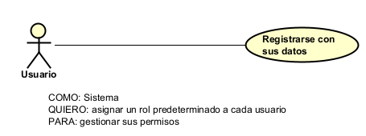                                                                                                                 |
| **Poscondiciones**           | El usuario queda registrado en el sistema.                                                                                                                                                                                                                                                                                                                                  |

| **Campo**                    | **Descripción**                                                                                                                                                                                                       |
| ---------------------------- | --------------------------------------------------------------------------------------------------------------------------------------------------------------------------------------------------------------------- |
| **ID**                       | RF-REG-02                                                                                                                                                                                                             |
| **Nombre del requerimiento** | Registro con tipo de correo electrónico                                                                                                                                                                               |
| **Descripción**              | El sistema debe permitir registrar usuarios utilizando diferentes tipos de correo electrónico (institucional o personal), identificando su tipo para procesos posteriores.                                            |
| **Precondiciones**           | 1. El sistema debe permitir ingreso de correos válidos. 2. Debe existir lógica para identificar tipo de correo.                                                                                                    |
| **Actor**                    | Usuario                                                                                                                                                                                                               |
| **Flujo Principal**          | 1. El usuario ingresa su correo electrónico. 2. El sistema identifica el dominio del correo. 3. El sistema clasifica el correo como institucional o personal. 4. El sistema continúa el proceso de registro. |
| **Flujo Alterno 1**          | 1. El correo no cumple formato válido. 2. El sistema muestra error. 3. El usuario debe corregirlo.                                                                                                              |
| **Diagrama de caso de uso**  |        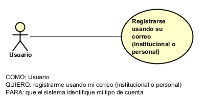                                                                                                                                                                   |
| **Poscondiciones**           | El tipo de correo queda registrado junto con el usuario.                                                                                                                                                              |

| **Campo**                    | **Descripción**                                                                                                                                                           |
| ---------------------------- | ------------------------------------------------------------------------------------------------------------------------------------------------------------------------- |
| **ID**                       | RF-REG-03                                                                                                                                                                 |
| **Nombre del requerimiento** | Registrar vínculo institucional                                                                                                                                           |
| **Descripción**              | El sistema debe permitir al usuario indicar su relación con la institución (ej. estudiante, docente, administrativo) para determinar los datos adicionales requeridos.    |
| **Precondiciones**           | 1. El sistema debe tener definidos los tipos de vínculo. 2. El usuario debe estar en proceso de registro.                                                              |
| **Actor**                    | Usuario                                                                                                                                                                   |
| **Flujo Principal**          | 1. El usuario selecciona su tipo de vínculo institucional. 2. El sistema guarda esta información. 3. El sistema adapta el formulario según el vínculo seleccionado. |
| **Flujo Alterno 1**          | 1. El usuario no selecciona ningún vínculo. 2. El sistema solicita seleccionar una opción obligatoria.                                                                 |
| **Diagrama de caso de uso**  | 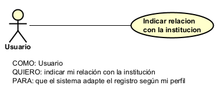                                                                                                                                     |
| **Poscondiciones**           | El vínculo institucional queda registrado.                                                                                                                                |

| **Campo**                    | **Descripción**                                                                                                                                                                                                           |
| ---------------------------- | ------------------------------------------------------------------------------------------------------------------------------------------------------------------------------------------------------------------------- |
| **ID**                       | RF-REG-04                                                                                                                                                                                                                 |
| **Nombre del requerimiento** | Registro de información académica (estudiante)                                                                                                                                                                            |
| **Descripción**              | El sistema debe solicitar información académica adicional (programa y semestre) cuando el usuario tenga rol de estudiante.                                                                                                |
| **Precondiciones**           | 1. El usuario debe haber seleccionado "estudiante" como vínculo institucional. 2. El sistema debe tener configurados programas académicos.                                                                             |
| **Actor**                    | Usuario (Estudiante)                                                                                                                                                                                                      |
| **Flujo Principal**          | 1. El usuario selecciona "estudiante". 2. El sistema solicita programa académico y semestre. 3. El usuario ingresa los datos. 4. El sistema valida la información. 5. El sistema guarda los datos académicos. |
| **Flujo Alterno 1**          | 1. El usuario deja campos vacíos. 2. El sistema muestra error. 3. El usuario completa los datos.                                                                                                                    |
| **Diagrama de caso de uso**  | 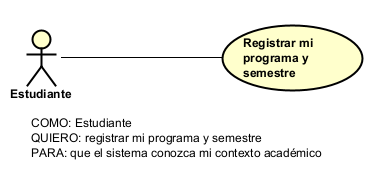                                                                                                                                                                      |
| **Poscondiciones**           | La información académica queda registrada.                                                                                                                                                                                |

| **Campo**                    | **Descripción**                                                                                                                                                                         |
| ---------------------------- | --------------------------------------------------------------------------------------------------------------------------------------------------------------------------------------- |
| **ID**                       | RF-REG-05                                                                                                                                                                               |
| **Nombre del requerimiento** | Asignación automática de rol                                                                                                                                                            |
| **Descripción**              | El sistema debe asignar automáticamente un rol predeterminado al usuario al completar su registro.                                                                                      |
| **Precondiciones**           | 1. Debe existir al menos un rol predeterminado configurado. 2. El registro debe haberse completado correctamente.                                                                    |
| **Actor**                    | Sistema                                                                                                                                                                                 |
| **Flujo Principal**          | 1. El usuario finaliza el registro. 2. El sistema identifica el tipo de usuario. 3. El sistema asigna el rol correspondiente. 4. El sistema guarda el rol en la base de datos. |
| **Flujo Alterno 1**          | 1. No existe rol configurado. 2. El sistema lanza error interno. 3. Se registra el incidente.                                                                                     |
| **Diagrama de caso de uso**  |      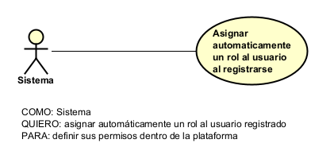                                                                                                                                             |
| **Poscondiciones**           | El usuario queda registrado con un rol asignado.                                                                                                                                        |

**Inactivar usuario**

| Campo | Descripción |
|------|-------------|
| **ID** | IDENT-EP-01 |
| **Título** | Funcionalidad para inactivar usuarios |
| **Descripción** | Permitir la desactivación de cuentas de usuarios inactivos dentro del sistema por un tiempo prolongado. Así mismo, no se podrá deshabilitar un usuario si este se encuentra vinculado a un equipo el cual, a su vez, este vinculado a un torneo activo o en proceso. |
| **Stakeholder** | Administrador y sistema |

Requerimientos:                                                                                                                                     |

| **Campo**                    | **Descripción**                                                                                                                                                                                                                                                                              |
| ---------------------------- | -------------------------------------------------------------------------------------------------------------------------------------------------------------------------------------------------------------------------------------------------------------------------------------------- |
| **ID**                       | RF-INACT-01                                                                                                                                                                                                                                                                                  |
| **Nombre del requerimiento** | Inactivar usuario manualmente                                                                                                                                                                                                                                                                |
| **Descripción**              | El sistema debe permitir al administrador inactivar manualmente la cuenta de un usuario.                                                                                                                                                                                                     |
| **Precondiciones**           | 1. El administrador debe haber iniciado sesión. 2. El usuario debe existir en el sistema.                                                                                                                                                                                                 |
| **Actor**                    | Administrador                                                                                                                                                                                                                                                                                |
| **Flujo Principal**          | 1. El administrador accede al módulo de usuarios. 2. El administrador selecciona un usuario. 3. El administrador selecciona la opción "Inactivar usuario". 4. El sistema valida restricciones. 5. El sistema cambia el estado a "inactivo". 6. El sistema confirma la acción. |
| **Flujo Alterno 1**          | 1. El usuario no existe. 2. El sistema muestra error.                                                                                                                                                                                                                                     |
| **Diagrama de caso de uso**  |       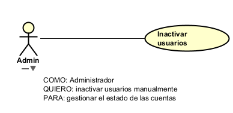                                                                                                                                                              |
| **Poscondiciones**           | El usuario queda inactivo.                                                                                                                                                                                                                                                                   |

| **Campo**                    | **Descripción**                                                                                                                                                                                                                                                                                     |
| ---------------------------- | --------------------------------------------------------------------------------------------------------------------------------------------------------------------------------------------------------------------------------------------------------------------------------------------------- |
| **ID**                       | RF-INACT-02                                                                                                                                                                                                                                                                                         |
| **Nombre del requerimiento** | Validar restricción por equipos y torneos                                                                                                                                                                                                                                                           |
| **Descripción**              | El sistema no debe permitir la inactivación de usuarios que estén vinculados a equipos que participen en torneos activos o en proceso.                                                                                                                                                              |
| **Precondiciones**           | 1. El usuario debe estar asociado a un equipo. 2. Debe existir información de torneos y su estado.                                                                                                                                                                                               |
| **Actor**                    | Sistema                                                                                                                                                                                                                                                                                             |
| **Flujo Principal**          | 1. El sistema verifica si el usuario pertenece a un equipo. 2. El sistema valida si el equipo está inscrito en un torneo. 3. El sistema verifica el estado del torneo. 4. Si el torneo está activo o en proceso, bloquea la inactivación. 5. El sistema muestra mensaje de restricción. |
| **Flujo Alterno 1**          | 1. El usuario no pertenece a ningún equipo. 2. El sistema permite la inactivación.                                                                                                                                                                                                               |
| **Flujo Alterno 2**          | 1. El equipo no está en torneos activos. 2. El sistema permite la inactivación.                                                                                                                                                                                                                  |
| **Diagrama de caso de uso**  | 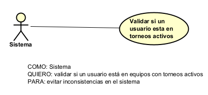                                                                                                                                                             |
| **Poscondiciones**           | Se garantiza la integridad de usuarios en torneos activos.                                                                                                                                                                                                                                          |

| **Campo**                    | **Descripción**                                                                                                                                                                |
| ---------------------------- | ------------------------------------------------------------------------------------------------------------------------------------------------------------------------------ |
| **ID**                       | RF-INACT-03                                                                                                                                                                    |
| **Nombre del requerimiento** | Notificación de inactivación                                                                                                                                                   |
| **Descripción**              | El sistema debe notificar al usuario cuando su cuenta sea inactivada.                                                                                                          |
| **Precondiciones**           | 1. El usuario debe tener un correo registrado. 2. El sistema debe tener habilitado el servicio de notificaciones.                                                           |
| **Actor**                    | Sistema                                                                                                                                                                        |
| **Flujo Principal**          | 1. El sistema detecta la inactivación del usuario. 2. El sistema genera una notificación. 3. El sistema envía el mensaje al usuario. 4. El sistema registra el envío. |
| **Flujo Alterno 1**          | 1. Error en el envío de notificación. 2. El sistema registra el error.                                                                                                      |
| **Diagrama de caso de uso**  | 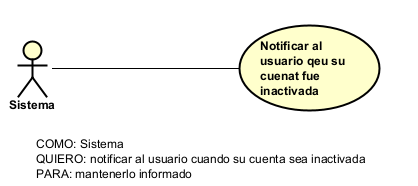                                                                                                                                                                   |
| **Poscondiciones**           | El usuario es informado de la inactivación.                                                                                                                                    |

**Autenticación (Login)**

| Campo | Descripción |
|------|-------------|
| **ID** | IDENT-EP-02 |
| **Título** | Funcionalidad para Autenticar usuarios al ingresar |
| **Descripción** | Permitir a los usuarios autenticarse en la plataforma mediante su correo ya sea personal o institucional (dependiendo su relación con la institución) y contraseña. El sistema deberá validar los datos proporcionadas y, en caso de ser correctas, habilitar el acceso a los recursos disponibles para el usuario. Así mismo, se deberán implementar mecanismos de seguridad para la protección de la información confidencial como las contraseñas, incluyendo su almacenamiento seguro y la gestión de sesiones mediante tokens de autenticación. |
| **Stakeholder** | Administrador y sistema |

Requerimientos:

| **Campo**                    | **Descripción**                                                                                                                                                                                                                                                                              |
| ---------------------------- | -------------------------------------------------------------------------------------------------------------------------------------------------------------------------------------------------------------------------------------------------------------------------------------------- |
| **ID**                       | RF-AUTH-01                                                                                                                                                                                                                                                                                   |
| **Nombre del requerimiento** | Autenticación de usuario (Login)                                                                                                                                                                                                                                                             |
| **Descripción**              | El sistema debe permitir a los usuarios autenticarse mediante su correo electrónico (personal o institucional) y contraseña para acceder a la plataforma.                                                                                                                                    |
| **Precondiciones**           | 1. El usuario debe estar registrado en el sistema. 2. El usuario debe estar activo. 3. El sistema debe tener acceso a la base de datos.                                                                                                                                                |
| **Actor**                    | Usuario                                                                                                                                                                                                                                                                                      |
| **Flujo Principal**          | 1. El usuario accede al formulario de login. 2. El usuario ingresa correo y contraseña. 3. El sistema valida el formato de los datos. 4. El sistema verifica las credenciales. 5. El sistema permite el acceso al usuario. 6. El sistema redirige al usuario a la plataforma. |
| **Flujo Alterno 1**          | 1. Credenciales incorrectas. 2. El sistema muestra mensaje de error. 3. El usuario intenta nuevamente.                                                                                                                                                                                 |
| **Flujo Alterno 2**          | 1. Usuario inactivo. 2. El sistema bloquea el acceso. 3. El sistema muestra mensaje informativo.                                                                                                                                                                                       |
| **Diagrama de caso de uso**  | 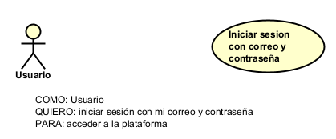                                                                                                                                                                   |
| **Poscondiciones**           | El usuario accede al sistema.                                                                                                                                                                                                                                                                |

| **Campo**                    | **Descripción**                                                                                                                                                                                                               |
| ---------------------------- | ----------------------------------------------------------------------------------------------------------------------------------------------------------------------------------------------------------------------------- |
| **ID**                       | RF-AUTH-02                                                                                                                                                                                                                    |
| **Nombre del requerimiento** | Validación de credenciales                                                                                                                                                                                                    |
| **Descripción**              | El sistema debe validar que el correo y la contraseña ingresados correspondan a un usuario registrado y activo.                                                                                                               |
| **Precondiciones**           | 1. Deben existir usuarios registrados. 2. Las contraseñas deben estar almacenadas de forma segura.                                                                                                                         |
| **Actor**                    | Sistema                                                                                                                                                                                                                       |
| **Flujo Principal**          | 1. El sistema recibe credenciales. 2. El sistema busca el usuario por correo. 3. El sistema compara la contraseña ingresada con la almacenada (encriptada). 4. El sistema determina si las credenciales son válidas. |
| **Flujo Alterno 1**          | 1. El usuario no existe. 2. El sistema retorna error de autenticación.                                                                                                                                                     |
| **Flujo Alterno 2**          | 1. La contraseña no coincide. 2. El sistema retorna error.                                                                                                                                                                 |
| **Diagrama de caso de uso**  | 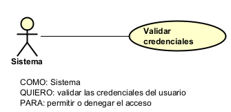                                                                                                                                                                   |
| **Poscondiciones**           | Se determina si el usuario puede autenticarse.                                                                                                                                                                                |

| **Campo**                    | **Descripción**                                                                                                                                                                  |
| ---------------------------- | -------------------------------------------------------------------------------------------------------------------------------------------------------------------------------- |
| **ID**                       | RF-AUTH-03                                                                                                                                                                       |
| **Nombre del requerimiento** | Generación de token de autenticación                                                                                                                                             |
| **Descripción**              | El sistema debe generar un token de autenticación al validar correctamente las credenciales del usuario para gestionar su sesión.                                                |
| **Precondiciones**           | 1. El usuario debe haberse autenticado correctamente. 2. Debe existir un mecanismo de generación de tokens.                                                                   |
| **Actor**                    | Sistema                                                                                                                                                                          |
| **Flujo Principal**          | 1. El sistema valida credenciales. 2. El sistema genera un token de autenticación. 3. El sistema asocia el token al usuario. 4. El sistema retorna el token al cliente. |
| **Flujo Alterno 1**          | 1. Error en generación del token. 2. El sistema retorna error de autenticación.                                                                                               |
| **Diagrama de caso de uso**  | 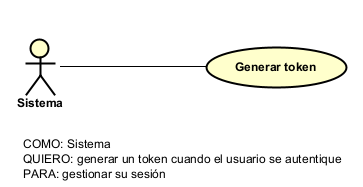                                                                                                                                                                   |
| **Poscondiciones**           | El usuario cuenta con un token válido para acceder a recursos.                                                                                                                   |

| **Campo**                    | **Descripción**                                                                                                                                                                                      |
| ---------------------------- | ---------------------------------------------------------------------------------------------------------------------------------------------------------------------------------------------------- |
| **ID**                       | RF-AUTH-04                                                                                                                                                                                           |
| **Nombre del requerimiento** | Protección de contraseñas                                                                                                                                                                            |
| **Descripción**              | El sistema debe almacenar las contraseñas de los usuarios de forma segura mediante mecanismos de cifrado o hashing.                                                                                  |
| **Precondiciones**           | 1. Debe existir un algoritmo de encriptación configurado. 2. El sistema debe manejar almacenamiento seguro.                                                                                       |
| **Actor**                    | Sistema                                                                                                                                                                                              |
| **Flujo Principal**          | 1. El usuario registra o ingresa contraseña. 2. El sistema aplica algoritmo de hash. 3. El sistema almacena la contraseña cifrada. 4. El sistema utiliza el hash para validaciones futuras. |
| **Flujo Alterno 1**          | 1. Error en proceso de cifrado. 2. El sistema detiene la operación.                                                                                                                               |
| **Diagrama de caso de uso**  | 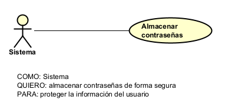                                                                                                                                                                   |
| **Poscondiciones**           | Las contraseñas se almacenan de forma segura.                                                                                                                                                        |

| **Campo**                    | **Descripción**                                                                                                                                                                                          |
| ---------------------------- | -------------------------------------------------------------------------------------------------------------------------------------------------------------------------------------------------------- |
| **ID**                       | RF-AUTH-05                                                                                                                                                                                               |
| **Nombre del requerimiento** | Gestión de sesión mediante token                                                                                                                                                                         |
| **Descripción**              | El sistema debe permitir la gestión de sesiones del usuario mediante el uso de tokens de autenticación para el acceso a recursos protegidos.                                                             |
| **Precondiciones**           | 1. El usuario debe tener un token válido. 2. El sistema debe validar tokens en cada petición.                                                                                                         |
| **Actor**                    | Sistema                                                                                                                                                                                                  |
| **Flujo Principal**          | 1. El usuario realiza una solicitud a un recurso protegido. 2. El sistema recibe el token. 3. El sistema valida el token. 4. El sistema permite o deniega el acceso según la validez del token. |
| **Flujo Alterno 1**          | 1. Token inválido o expirado. 2. El sistema rechaza la solicitud. 3. El sistema solicita nueva autenticación.                                                                                      |
| **Diagrama de caso de uso**  | 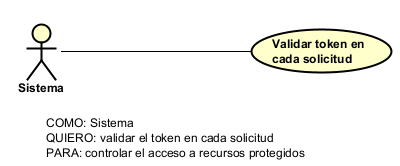                                                                                                                                                                   |
| **Poscondiciones**           | El acceso a recursos está controlado mediante tokens.                                                                                                                                                    |

**Autorización (Roles y Permisos)**

| Campo | Descripción |
|------|-------------|
| **ID** | IDENT-EP-03 |
| **Título** | Funcionalidad para gestionar roles y permisos de los usuarios del sistema |
| **Descripción** | Esta funcionalidad permite administrar los diferentes roles del sistema y los permisos asociados a cada uno. Es fundamental para controlar las acciones que cada usuario puede realizar dentro de la plataforma, garantizando que cada rol tenga acceso únicamente a las funcionalidades que le corresponden. |
| **Stakeholder** | Administrador, Organizador, Sistema |

Requerimientos:

| Campo | Descripción                                                                                                                                                                                                                                                                                                                                                                                                    |
|------|----------------------------------------------------------------------------------------------------------------------------------------------------------------------------------------------------------------------------------------------------------------------------------------------------------------------------------------------------------------------------------------------------------------|
| **ID** | RF-IDENT-01                                                                                                                                                                                                                                                                                                                                                                                                    |
| **Nombre del requerimiento** | Crear roles del sistema                                                                                                                                                                                                                                                                                                                                                                                        |
| **Descripción** | El sistema debe permitir al administrador crear nuevos roles dentro del sistema para definir diferentes niveles de acceso y responsabilidades para los usuarios.                                                                                                                                                                                                                                               |
| **Precondiciones** | 1. El administrador debe haber iniciado sesión en el sistema. 2. El sistema debe tener habilitado el módulo de gestión de roles. 3. Debe existir una base de datos disponible para almacenar los roles.                                                                                                                                                                                                  |
| **Actor** | Administrador                                                                                                                                                                                                                                                                                                                                                                                                  |
| **Flujo Principal** | 1. El administrador ingresa a la aplicación. 2. El administrador accede al módulo de gestión de roles. 3. El administrador selecciona la opción "Crear rol". 4. El administrador ingresa el nombre del rol. 5. El sistema valida que el rol no exista previamente. 6. El sistema registra el nuevo rol en la base de datos. 7. El sistema muestra un mensaje confirmando la creación del rol. |
| **Flujo Alterno 1** | 1. El administrador ingresa un nombre de rol existente. 2. El sistema detecta que el rol ya existe. 3. El sistema muestra un mensaje indicando que el rol ya está registrado. 4. El administrador debe ingresar un nombre diferente.                                                                                                                                                                  |
| **Diagrama de caso de uso** | 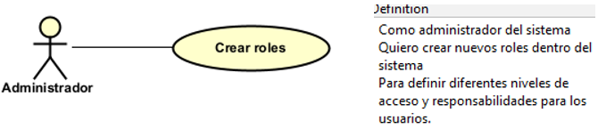                                                                                                                                                                                                                                                                                                                                                              |
| **Poscondiciones** | El nuevo rol queda registrado en el sistema y disponible para ser asignado a usuarios.                                                                                                                                                                                                                                                                                                                         |

| Campo | Descripción                                                                                                                                                                                                                                                                                                                                                                         |
|------|-------------------------------------------------------------------------------------------------------------------------------------------------------------------------------------------------------------------------------------------------------------------------------------------------------------------------------------------------------------------------------------|
| **ID** | RF-IDENT-02                                                                                                                                                                                                                                                                                                                                                                         |
| **Nombre del requerimiento** | Asignar permisos a roles                                                                                                                                                                                                                                                                                                                                                            |
| **Descripción** | El sistema debe permitir al administrador asignar permisos a los roles existentes para definir las acciones que los usuarios pueden realizar en el sistema.                                                                                                                                                                                                                         |
| **Precondiciones** | 1. El administrador debe haber iniciado sesión. 2. Deben existir roles previamente creados. 3. Deben existir permisos definidos en el sistema.                                                                                                                                                                                                                                |
| **Actor** | Administrador                                                                                                                                                                                                                                                                                                                                                                       |
| **Flujo Principal** | 1. El administrador ingresa a la aplicación. 2. El administrador accede al módulo de roles. 3. El administrador selecciona un rol existente. 4. El sistema muestra los permisos disponibles. 5. El administrador selecciona los permisos que desea asignar. 6. El sistema guarda los permisos asociados al rol. 7. El sistema muestra un mensaje de confirmación. |
| **Flujo Alterno 1** | 1. El administrador selecciona un permiso no válido. 2. El sistema detecta el error. 3. El sistema muestra un mensaje indicando que el permiso no es válido.                                                                                                                                                                                                                  |
| **Diagrama de caso de uso** | 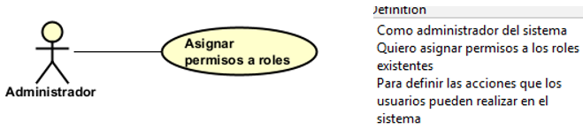                                                                                                                                                                                                                                                                                                                                    |
| **Poscondiciones** | El rol tendrá permisos asociados correctamente.                                                                                                                                                                                                                                                                                                                                     |

| Campo | Descripción                                                                                                                                                                                                                                                                                                                                                                                                      |
|------|------------------------------------------------------------------------------------------------------------------------------------------------------------------------------------------------------------------------------------------------------------------------------------------------------------------------------------------------------------------------------------------------------------------|
| **ID** | RF-IDENT-03                                                                                                                                                                                                                                                                                                                                                                                                      |
| **Nombre del requerimiento** | Asignar roles a usuarios                                                                                                                                                                                                                                                                                                                                                                                         |
| **Descripción** | El sistema debe permitir al administrador asignar uno o varios roles a los usuarios para controlar las funcionalidades a las que pueden acceder.                                                                                                                                                                                                                                                                 |
| **Precondiciones** | 1. El administrador debe haber iniciado sesión. 2. Deben existir usuarios registrados. 3. Deben existir roles previamente creados.                                                                                                                                                                                                                                                                         |
| **Actor** | Administrador                                                                                                                                                                                                                                                                                                                                                                                                    |
| **Flujo Principal** | 1. El administrador ingresa al sistema. 2. El administrador accede al módulo de usuarios. 3. El administrador selecciona un usuario registrado. 4. El sistema muestra los roles disponibles. 5. El administrador selecciona uno o varios roles. 6. El sistema valida la información. 7. El sistema asigna los roles al usuario. 8. El sistema muestra un mensaje confirmando la asignación. |
| **Flujo Alterno 1** | 1. El administrador selecciona un usuario inexistente. 2. El sistema detecta que el usuario no existe. 3. El sistema muestra un mensaje indicando el error.                                                                                                                                                                                                                                                |
| **Diagrama de caso de uso** | 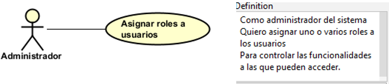                                                                                                                                                                                                                                                                                                                                                                 |
| **Poscondiciones** | El usuario tendrá los roles asignados correctamente.                                                                                                                                                                                                                                                                                                                                                             |

| Campo | Descripción                                                                                                                                                                                                                                        |
|------|----------------------------------------------------------------------------------------------------------------------------------------------------------------------------------------------------------------------------------------------------|
| **ID** | RF-IDENT-04                                                                                                                                                                                                                                        |
| **Nombre del requerimiento** | Consultar roles asignados a usuario                                                                                                                                                                                                                |
| **Descripción** | El sistema debe permitir al administrador consultar los roles asignados a un usuario para verificar los permisos que posee dentro del sistema.                                                                                                     |
| **Precondiciones** | 1. El administrador debe haber iniciado sesión. 2. Deben existir usuarios registrados.                                                                                                                                                          |
| **Actor** | Administrador                                                                                                                                                                                                                                      |
| **Flujo Principal** | 1. El administrador ingresa al sistema. 2. El administrador accede al módulo de usuarios. 3. El administrador selecciona un usuario. 4. El sistema consulta los roles asignados. 5. El sistema muestra los roles asociados al usuario. |
| **Flujo Alterno 1** | No aplica.                                                                                                                                                                                                                                         |
| **Diagrama de caso de uso** | 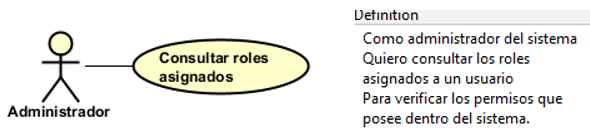                                                                                                                                                                                                   |
| **Poscondiciones** | El administrador visualiza correctamente los roles asignados al usuario.                                                                                                                                                                           |

**Gestión de sesión**

| Campo | Descripción |
|------|-------------|
| **ID** | IDENT-EP-04 |
| **Título** | Funcionalidad para gestionar sesiones de usuario mediante tokens JWT |
| **Descripción** | Esta funcionalidad permite gestionar la autenticación de los usuarios mediante la generación, validación y expiración de tokens JWT. Es fundamental para mantener sesiones seguras y controlar el acceso continuo a los servicios del sistema. |
| **Stakeholder** | Usuario, Sistema, Administrador |

Requerimientos: 

| Campo | Descripción                                                                                                                                                                                                                                                                                                                                                                         |
|------|-------------------------------------------------------------------------------------------------------------------------------------------------------------------------------------------------------------------------------------------------------------------------------------------------------------------------------------------------------------------------------------|
| **ID** | RF-IDENT-05                                                                                                                                                                                                                                                                                                                                                                         |
| **Nombre del requerimiento** | Iniciar sesión                                                                                                                                                                                                                                                                                                                                                                      |
| **Descripción** | El sistema debe permitir a los usuarios iniciar sesión mediante el ingreso de sus credenciales (correo electrónico y contraseña) para acceder a las funcionalidades del sistema.                                                                                                                                                                                                    |
| **Precondiciones** | 1. El usuario debe estar registrado en el sistema. 2. El sistema debe tener habilitado el módulo de autenticación. 3. La base de datos debe estar disponible para validar las credenciales.                                                                                                                                                                                   |
| **Actor** | Usuario                                                                                                                                                                                                                                                                                                                                                                             |
| **Flujo Principal** | 1. El usuario ingresa a la aplicación. 2. El usuario selecciona la opción "Iniciar sesión". 3. El sistema muestra el formulario de inicio de sesión. 4. El usuario ingresa su correo electrónico y contraseña. 5. El sistema valida las credenciales ingresadas. 6. El sistema permite el acceso al sistema. 7. El sistema redirige al usuario al menú principal. |
| **Flujo Alterno 1** | 1. El usuario ingresa credenciales incorrectas. 2. El sistema detecta que las credenciales no son válidas. 3. El sistema muestra un mensaje indicando que las credenciales son incorrectas. 4. El usuario debe intentar nuevamente.                                                                                                                                        |
| **Diagrama de caso de uso** | 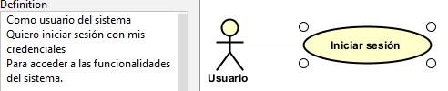                                                                                                                                                                                                                                                                                                                                    |
| **Poscondiciones** | El usuario accede correctamente al sistema con una sesión activa.                                                                                                                                                                                                                                                                                                                   |

| Campo | Descripción                                                                                                                                                                                                                                               |
|------|-----------------------------------------------------------------------------------------------------------------------------------------------------------------------------------------------------------------------------------------------------------|
| **ID** | RF-IDENT-06                                                                                                                                                                                                                                               |
| **Nombre del requerimiento** | Generar token JWT                                                                                                                                                                                                                                         |
| **Descripción** | El sistema debe generar un token JWT cuando el usuario inicia sesión correctamente para autenticar sus solicitudes futuras de forma segura.                                                                                                               |
| **Precondiciones** | 1. El usuario debe haber ingresado credenciales válidas. 2. El sistema debe tener configurado el mecanismo de generación de tokens JWT.                                                                                                                |
| **Actor** | Sistema                                                                                                                                                                                                                                                   |
| **Flujo Principal** | 1. El usuario ingresa credenciales válidas. 2. El sistema valida las credenciales. 3. El sistema genera un token JWT asociado al usuario. 4. El sistema envía el token al usuario. 5. El sistema almacena la información necesaria del token. |
| **Flujo Alterno 1** | 1. El sistema detecta un error al generar el token. 2. El sistema muestra un mensaje indicando que ocurrió un error. 3. El sistema solicita al usuario intentar nuevamente.                                                                         |
| **Diagrama de caso de uso** | 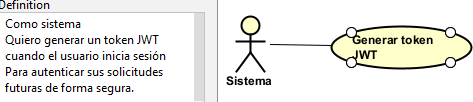                                                                                                                                                                                                          |
| **Poscondiciones** | El usuario obtiene un token JWT válido para autenticarse en futuras solicitudes.                                                                                                                                                                          |

| Campo | Descripción                                                                                                                                                                                                                                                               |
|------|---------------------------------------------------------------------------------------------------------------------------------------------------------------------------------------------------------------------------------------------------------------------------|
| **ID** | RF-IDENT-07                                                                                                                                                                                                                                                               |
| **Nombre del requerimiento** | Validar token JWT                                                                                                                                                                                                                                                         |
| **Descripción** | El sistema debe validar el token JWT en cada solicitud realizada por el usuario para garantizar que esté autenticado y autorizado para acceder a los recursos.                                                                                                            |
| **Precondiciones** | 1. El usuario debe haber iniciado sesión previamente. 2. El usuario debe poseer un token JWT válido.                                                                                                                                                                   |
| **Actor** | Sistema                                                                                                                                                                                                                                                                   |
| **Flujo Principal** | 1. El usuario realiza una solicitud al sistema. 2. El sistema recibe el token JWT en la solicitud. 3. El sistema verifica la validez del token. 4. El sistema valida la fecha de expiración del token. 5. El sistema permite el acceso si el token es válido. |
| **Flujo Alterno 1** | 1. El sistema detecta que el token ha expirado o es inválido. 2. El sistema bloquea la solicitud. 3. El sistema solicita al usuario iniciar sesión nuevamente.                                                                                                      |
| **Diagrama de caso de uso** | 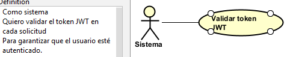                                                                                                                                                                                                                          |
| **Poscondiciones** | El sistema valida correctamente la autenticidad del usuario antes de permitir el acceso a los recursos.                                                                                                                                                                   |

| Campo | Descripción                                                                                                                                                                                                                                                                 |
|------|-----------------------------------------------------------------------------------------------------------------------------------------------------------------------------------------------------------------------------------------------------------------------------|
| **ID** | RF-IDENT-08                                                                                                                                                                                                                                                                 |
| **Nombre del requerimiento** | Cerrar sesión                                                                                                                                                                                                                                                               |
| **Descripción** | El sistema debe permitir al usuario cerrar su sesión activa para finalizar el acceso seguro al sistema.                                                                                                                                                                     |
| **Precondiciones** | 1. El usuario debe tener una sesión activa en el sistema. 2. El sistema debe tener habilitado el módulo de gestión de sesiones.                                                                                                                                          |
| **Actor** | Usuario                                                                                                                                                                                                                                                                     |
| **Flujo Principal** | 1. El usuario accede al menú principal. 2. El usuario selecciona la opción "Cerrar sesión". 3. El sistema invalida el token JWT del usuario. 4. El sistema finaliza la sesión del usuario. 5. El sistema redirige al usuario a la pantalla de inicio de sesión. |
| **Flujo Alterno 1** | 1. El sistema detecta un error al cerrar la sesión. 2. El sistema muestra un mensaje indicando que ocurrió un error. 3. El usuario debe intentar nuevamente.                                                                                                          |
| **Diagrama de caso de uso** | 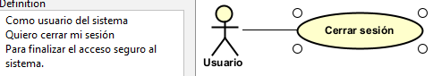                                                                                                                                                                                                                            |
| **Poscondiciones** | La sesión del usuario queda cerrada y el token JWT deja de ser válido.                                                                                                                                                                                                      |

**Control de acceso**

| Campo | Descripción |
|------|-------------|
| **ID** | IDENT-EP-05 |
| **Título** | Funcionalidad para validar el acceso de usuarios a recursos del sistema |
| **Descripción** | Esta funcionalidad permite verificar que los usuarios autenticados tengan los permisos necesarios para acceder a los diferentes recursos y funcionalidades del sistema. Es esencial para evitar accesos no autorizados y proteger la integridad del sistema. |
| **Stakeholder** | Usuario, Sistema, Administrador |

Requerimientos: 

| Campo | Descripción                                                                                                                                                                                                                                                                                                                                                       |
|------|-------------------------------------------------------------------------------------------------------------------------------------------------------------------------------------------------------------------------------------------------------------------------------------------------------------------------------------------------------------------|
| **ID** | RF-IDENT-09                                                                                                                                                                                                                                                                                                                                                       |
| **Nombre del requerimiento** | Validar permisos en solicitudes                                                                                                                                                                                                                                                                                                                                   |
| **Descripción** | El sistema debe validar los permisos del usuario en cada solicitud realizada para permitir únicamente el acceso a recursos autorizados.                                                                                                                                                                                                                           |
| **Precondiciones** | 1. El usuario debe estar autenticado en el sistema. 2. El usuario debe poseer un token JWT válido. 3. El sistema debe tener definidos roles y permisos asociados.                                                                                                                                                                                           |
| **Actor** | Sistema                                                                                                                                                                                                                                                                                                                                                           |
| **Flujo Principal** | 1. El usuario realiza una solicitud al sistema. 2. El sistema recibe la solicitud junto con el token JWT. 3. El sistema valida el token JWT. 4. El sistema identifica el rol del usuario. 5. El sistema verifica los permisos asociados al rol. 6. El sistema permite el acceso al recurso solicitado si el usuario tiene los permisos necesarios. |
| **Flujo Alterno 1** | 1. El sistema detecta que el usuario no posee los permisos necesarios. 2. El sistema rechaza la solicitud. 3. El sistema muestra un mensaje indicando que no tiene permisos suficientes.                                                                                                                                                                    |
| **Diagrama de caso de uso** | 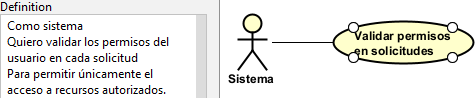                                                                                                                                                                                                                                                                                                                  |
| **Poscondiciones** | El acceso al recurso es permitido únicamente si el usuario posee los permisos requeridos.                                                                                                                                                                                                                                                                         |

| Campo | Descripción                                                                                                                                                                                                                                                                                                                                                                                      |
|------|--------------------------------------------------------------------------------------------------------------------------------------------------------------------------------------------------------------------------------------------------------------------------------------------------------------------------------------------------------------------------------------------------|
| **ID** | RF-IDENT-10                                                                                                                                                                                                                                                                                                                                                                                      |
| **Nombre del requerimiento** | Bloquear accesos no autorizados                                                                                                                                                                                                                                                                                                                                                                  |
| **Descripción** | El sistema debe bloquear solicitudes que no cuenten con permisos suficientes para proteger los recursos del sistema contra accesos no autorizados.                                                                                                                                                                                                                                               |
| **Precondiciones** | 1. El sistema debe estar ejecutando la validación de permisos. 2. Deben existir reglas de control de acceso definidas.                                                                                                                                                                                                                                                                        |
| **Actor** | Sistema                                                                                                                                                                                                                                                                                                                                                                                          |
| **Flujo Principal** | 1. El usuario realiza una solicitud a un recurso protegido. 2. El sistema verifica el token JWT. 3. El sistema valida los permisos del usuario. 4. El sistema detecta que el usuario no posee permisos suficientes. 5. El sistema bloquea la solicitud. 6. El sistema registra el intento de acceso no autorizado. 7. El sistema muestra un mensaje indicando acceso denegado. |
| **Flujo Alterno 1** | 1. El sistema detecta que el token JWT no está presente. 2. El sistema bloquea automáticamente la solicitud. 3. El sistema solicita autenticación previa.                                                                                                                                                                                                                                  |
| **Diagrama de caso de uso** | 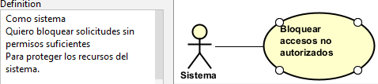                                                                                                                                                                                                                                                                                                                                               |
| **Poscondiciones** | El acceso no autorizado queda bloqueado y el recurso permanece protegido.                                                                                                                                                                                                                                                                                                                        |

**Auditoría**

| Campo | Descripción |
|------|-------------|
| **ID** | IDENT-EP-06 |
| **Título** | Funcionalidad para registrar eventos y acciones relevantes del sistema |
| **Descripción** | Esta funcionalidad permite registrar y almacenar eventos importantes relacionados con el uso del sistema, como registros de usuarios, inicios y cierres de sesión. Es fundamental para mantener trazabilidad, monitoreo de seguridad y control de actividades dentro del sistema. |
| **Stakeholder** | Administrador, Sistema, Organizador |

Requerimientos: 

| Campo | Descripción                                                                                                                                                                                                                                                                                          |
|------|------------------------------------------------------------------------------------------------------------------------------------------------------------------------------------------------------------------------------------------------------------------------------------------------------|
| **ID** | RF-IDENT-11                                                                                                                                                                                                                                                                                          |
| **Nombre del requerimiento** | Registrar inicio de sesión                                                                                                                                                                                                                                                                           |
| **Descripción** | El sistema debe registrar los eventos de inicio de sesión de los usuarios para mantener trazabilidad de accesos al sistema.                                                                                                                                                                          |
| **Precondiciones** | 1. El usuario debe estar registrado en el sistema. 2. El sistema debe tener habilitado el módulo de auditoría. 3. Debe existir un mecanismo para almacenar registros de auditoría.                                                                                                             |
| **Actor** | Sistema                                                                                                                                                                                                                                                                                              |
| **Flujo Principal** | 1. El usuario ingresa sus credenciales. 2. El sistema valida las credenciales correctamente. 3. El sistema genera un evento de inicio de sesión. 4. El sistema registra la fecha, hora y usuario que inició sesión. 5. El sistema almacena el registro en la base de datos de auditoría. |
| **Flujo Alterno 1** | 1. El sistema detecta un error al registrar el evento. 2. El sistema genera un mensaje interno de error. 3. El sistema intenta registrar nuevamente el evento.                                                                                                                                 |
| **Diagrama de caso de uso** | 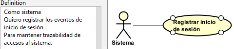                                                                                                                                                                                                                                                   |
| **Poscondiciones** | El evento de inicio de sesión queda almacenado correctamente en el sistema de auditoría.                                                                                                                                                                                                             |

| Campo | Descripción                                                                                                                                                                                                                                                                                     |
|------|-------------------------------------------------------------------------------------------------------------------------------------------------------------------------------------------------------------------------------------------------------------------------------------------------|
| **ID** | RF-IDENT-12                                                                                                                                                                                                                                                                                     |
| **Nombre del requerimiento** | Registrar cierre de sesión                                                                                                                                                                                                                                                                      |
| **Descripción** | El sistema debe registrar los eventos de cierre de sesión para mantener un historial de actividad del usuario dentro del sistema.                                                                                                                                                               |
| **Precondiciones** | 1. El usuario debe tener una sesión activa. 2. El sistema debe tener habilitado el módulo de auditoría.                                                                                                                                                                                      |
| **Actor** | Sistema                                                                                                                                                                                                                                                                                         |
| **Flujo Principal** | 1. El usuario selecciona la opción "Cerrar sesión". 2. El sistema invalida el token JWT. 3. El sistema genera un evento de cierre de sesión. 4. El sistema registra la fecha, hora y usuario que cerró sesión. 5. El sistema almacena el registro en la base de datos de auditoría. |
| **Flujo Alterno 1** | 1. El sistema detecta un error al registrar el evento. 2. El sistema genera un mensaje interno de error. 3. El sistema intenta registrar nuevamente el evento.                                                                                                                            |
| **Diagrama de caso de uso** | 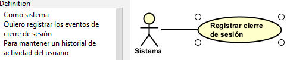                                                                                                                                                                                                                                              |
| **Poscondiciones** | El evento de cierre de sesión queda almacenado correctamente en el sistema de auditoría.                                                                                                                                                                                                        |

| Campo | Descripción                                                                                                                                                                                                                                                            |
|------|------------------------------------------------------------------------------------------------------------------------------------------------------------------------------------------------------------------------------------------------------------------------|
| **ID** | RF-IDENT-13                                                                                                                                                                                                                                                            |
| **Nombre del requerimiento** | Registrar eventos críticos del sistema                                                                                                                                                                                                                                 |
| **Descripción** | El sistema debe registrar eventos críticos del sistema, como accesos no autorizados, errores de autenticación o modificaciones relevantes, para permitir auditorías y análisis de seguridad.                                                                           |
| **Precondiciones** | 1. El sistema debe tener habilitado el módulo de auditoría. 2. Debe existir una base de datos destinada al almacenamiento de eventos críticos.                                                                                                                      |
| **Actor** | Sistema                                                                                                                                                                                                                                                                |
| **Flujo Principal** | 1. El sistema detecta un evento crítico. 2. El sistema genera un registro del evento. 3. El sistema almacena información relevante como tipo de evento, usuario involucrado, fecha y hora. 4. El sistema guarda el registro en la base de datos de auditoría. |
| **Flujo Alterno 1** | 1. El sistema detecta un error al almacenar el evento. 2. El sistema registra el error internamente. 3. El sistema intenta guardar nuevamente el evento.                                                                                                         |
| **Diagrama de caso de uso** | 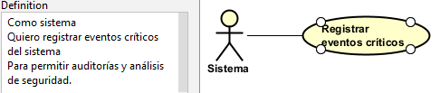                                                                                                                                                                                                                     |
| **Poscondiciones** | El evento crítico queda registrado y disponible para futuras auditorías y análisis de seguridad.                                                                                                                                                                       |
